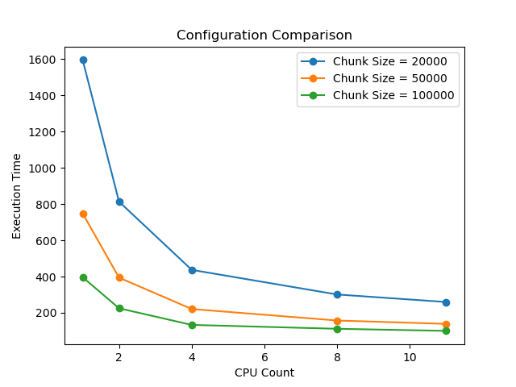
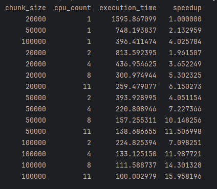

# Big Data Analysis

## Assignment 1

Data for this code is taken from http://web.ais.dk/aisdata/
date used: 2025-01-02

`main.py` - main code for running in parallel (one configuration)

`main_experiment.py` - code to run with different chunk_sizes/cpu_counts. Returns execution times and generates plots.

`functions.py` - Functions

Key points:
- Parallelization is done with `pool.imap()`
  
- Identifying Location Anomalies - These are detected by calculting distance between timestamps, and if the distance is very far, then it gets identified as a anomaly
- Analyzing Speed and Course Consistency - Mean and Standard Deviation is calculated for each vessel. IF the speed is `k * std` away from the mean, then it's flagged as an anomaly 
- Comparing Neighboring Vessel Data - This isn't fully finished. Conflicting coordinates are only being checked inside of chunks. This is problematic because there can be conflicting vessels that are in different chunks.

Speed Evaluation:

  
  

