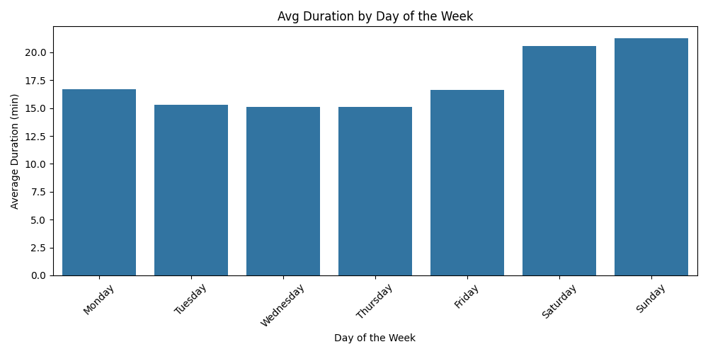
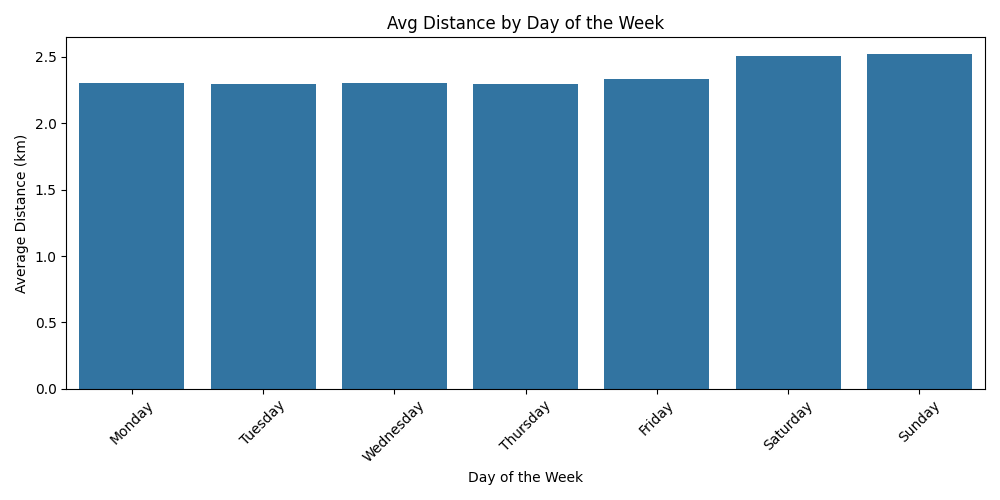
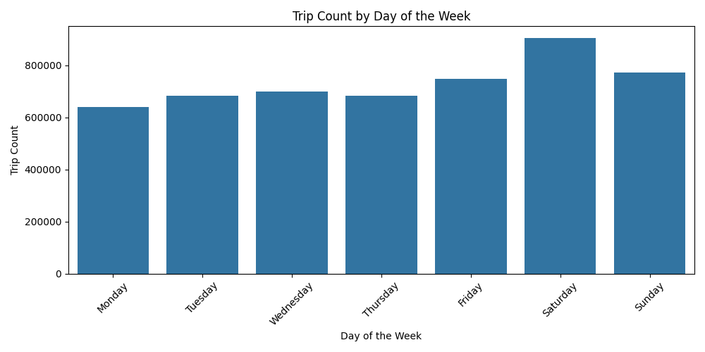
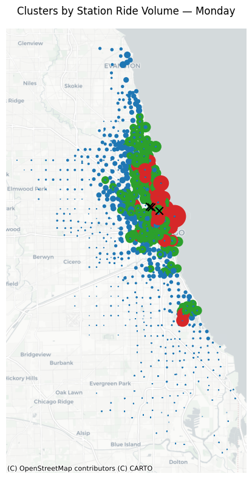
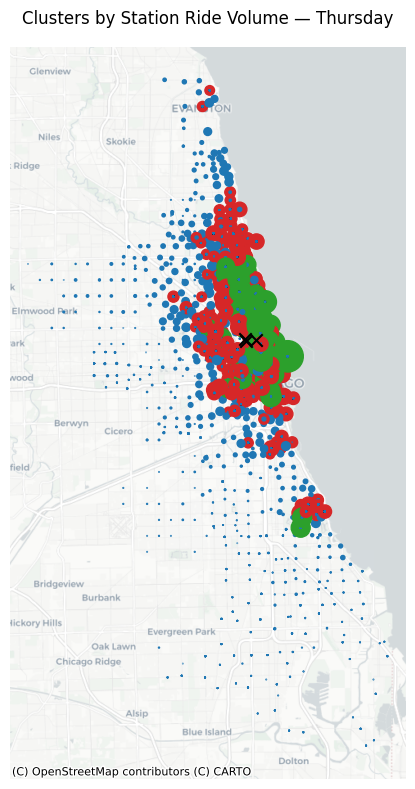
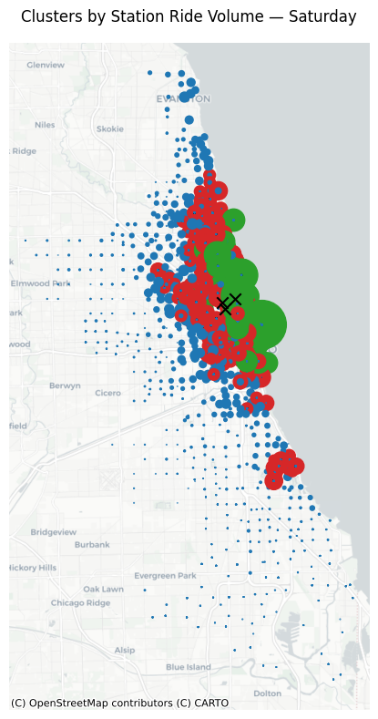
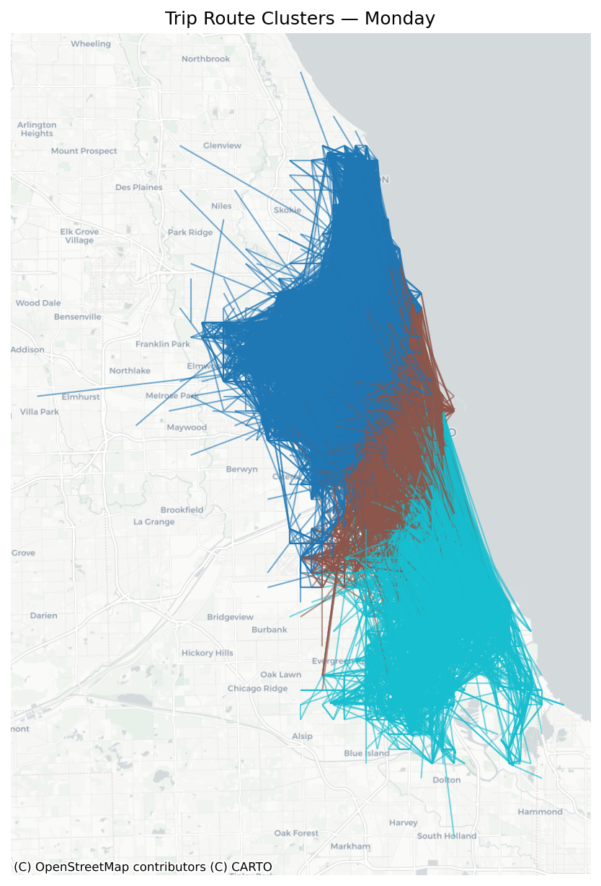
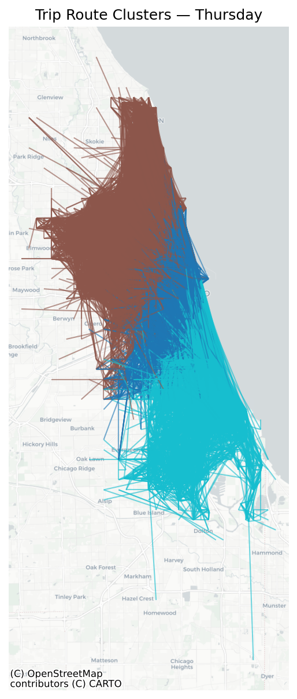
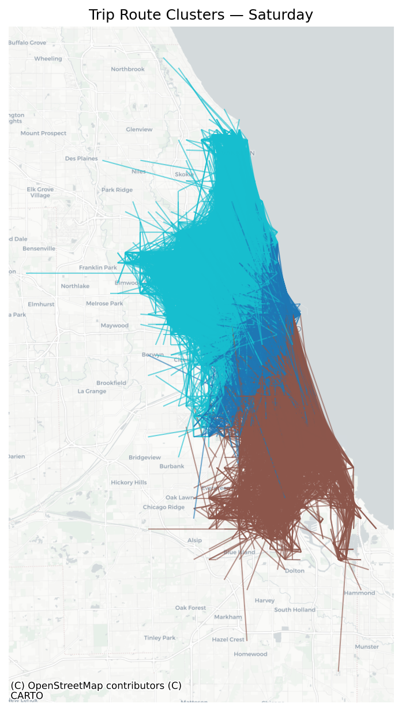
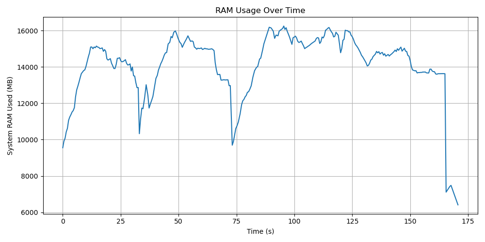

# Individual Task

## Analysis of Bike Trip Distance and Duration by Day of the Week

The goal of this task is to use parallelisation to read, process and output results about Bike Trip for a whole year.

This project performs analysis of bike trip data using Python. It focuses on **distance and duration trends** by day of the week, cleans and transforms raw GPS ride data, and uses **clustering and geospatial visualization**.

---
### 0. Folder Structure
- `rent_bike.py` - the main script to run
- `functions.py` - file with all the functions
- `data/` - needs to contain the 12 input data files - IMPORTANT
- `output/` - all output plots

---
### 00. Docker
- The docker image is published on `rgulbinovic/rental-bike-analysis`
- To run it on Linux you run:
    - `docker run \
  -v $(pwd)/data:/app/data \
  -v $(pwd)/output:/app/output \
  rgulbinovic/bike-rent-analysis`

---
### 1. Read and Clean Data

- Loads all monthly CSVs from the `data/` folder in parallel
- Drops rows with invalid/missing GPS coordinates
- Removes outliers based on:
  - Duration (<1 or >240 minutes)
  - Distance (<0.1 km or >50 km)
- Calculates:
  - Trip duration in minutes
  - Haversine distance in km
  - Average speed (km/h)
  - extracts day of the week

This deletes about ~470 000 rows:

- Rows removed due to invalid GPS coordinates: 4771
- Rows removed due to outliers: 455994

---

### 2. Trip Statistics and Analysis

- We compute:
  - Average trip duration, distance, and speed by weekday
  - Most popular starting stations
  - Slowest station-to-station routes (long duration per km)
  - Most frequently used routes

- Visualizations:
  - Print out results
  - Bar plots for duration, distance, and trip count by day

---

### 3. Geospatial Clustering
#### Volume Clustering
- Applies **KMeans clustering** on trip start coordinates for each day
- Visualizes clusters with:
  - `GeoPandas` for geometry
  - `Contextily` for map tiles
- Cluster centers are shown with black `×` markers

  
  
  

#### Full Trip Clustering
- Applies **KMeans clustering** on both trip start and end coordinates for each weekday
- Reveals full-trip travel patterns and directional flow
- Visualizes clusters using:
  - `GeoPandas` for line geometries
  - `Contextily` for background map tiles

  
  
  

---

### 4. Performance Monitoring

- Logs memory usage with `psutil`
- Sequential execution time = 600-700 s.
- Parallel execution time = 160 s.

